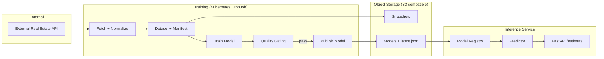

# Norway Real Estate Price Estimator

Production-like AI / MLOps project for estimating real estate prices in Norway based on historical sales data.
End-to-end AI system for estimating **current market prices** of residential real estate in Norway.
The project demonstrates the complete path: data → ML pipeline → model registry → API → Kubernetes → CI/CD.

## 🚀 What this project does

The project demonstrates the complete path: **data → ML pipeline → model registry → API → Kubernetes → CI/CD**.

* Fetches real real-estate transactions from an external API
* Builds clean, validated datasets
* Trains ML models for price estimation
* Applies quality gating before publishing models
* Stores artifacts in S3-compatible storage (MinIO / GCS)
* Serves predictions via FastAPI
* Retrains models automatically on a schedule in Kubernetes
* Deploys to GKE via Helm and GitHub Actions

## 🧱 High-level architecture


## 📦 Components

### 1. Training pipeline

* Runs as Kubernetes CronJob
* Periodically:
   * fetches data for a given time window
   * validates and normalizes rows
   * trains a sklearn model
   * evaluates metrics
   * applies gating rules
   * publishes artifacts if quality is acceptable

**Artifacts stored:**
* raw rows (`rows_raw.jsonl`)
* training dataset (`dataset.parquet`)
* manifest (`manifest.json`)
* model (`model.pkl`)
* registry pointer (`latest.json`)

### 2. Model Registry

* Stored in object storage
* Each model version is immutable
* `latest.json` points to the currently active model
* API will not serve predictions until a valid model exists

### 3. API service (FastAPI)

**Endpoints:**
* `GET /health` — liveness
* `GET /ready` — readiness (model loaded)
* `POST /estimate` — batch price estimation

**Key design decisions:**
* Batch-first API (`property_id → features`)
* Strict validation (better no result than a wrong one)
* Predictor logic isolated from HTTP layer

### 4. Storage

* **Local / kind:** MinIO
* **GKE:** Google Cloud Storage via S3 interoperability
* Same code works in both environments

> ⚠️ **Note:** boto3 uploads require `ContentLength` to avoid aws-chunked uploads when using GCS S3 compatibility.

## 🧠 Machine Learning

### Current approach

* Tabular regression (sklearn)
* **Features:**
   * areas (`total_area`, `usable_area`)
   * location (lat/lon, municipality)
   * building metadata
   * real estate type

### Metrics

* MAE
* RMSE
* Metrics per:
   * `realestate_type`
   * top municipalities

### Gating rules

A new model is published only if:
* enough training data is available
* overall quality does not degrade beyond a threshold
* key segment (`enebolig`) does not regress excessively

**If gating fails** → previous model remains active.

## ☸️ Kubernetes & Deployment

* Helm chart (`deploy/helm`)
* Separate configs for:
   * `kind` (local)
   * `GKE`
* Resources and limits explicitly set
* Training runs as CronJob
* API runs as Deployment with readiness checks

## 🔄 CI/CD

**Release flow:**

1. Push git tag `vX.Y.Z`
2. GitHub Actions:
   * build Docker image
   * push to GHCR
   * deploy to GKE via Helm
   * update Kubernetes secrets
3. New version rolls out automatically

## 🧪 Local development

### Prerequisites

* Docker
* Python 3.11+
* `uv`
* RabbitMQ (for local async)
* MinIO (optional)

### Run locally
```bash
cp .env.example .env
uv lock
make compose-up
```
## Useful Links

| Service | URL | Credentials |
|---------|-----|-------------|
| **RabbitMQ Management UI** | http://localhost:15672 | `guest` / `guest` |
| **MinIO Console** | http://localhost:9001 | See `.env` |
| **MinIO S3 Endpoint** | http://localhost:9000 | - |

### 3) Create stub model
```bash
uv run python -m scripts.bootstrap_model_registry
```

### 4) Start application (FastAPI + Celery worker)
```bash
honcho start
```

## Open:
- [Swagger](http://localhost:8080/docs)
- [ReDoc](http://localhost:8080/redoc)
- [Health](http://localhost:8080/health)

## Training (dry-run snapshots)
Fetch data for a date range, build dataset, and upload snapshots to MinIO:

```bash
uv run python -m scripts.train --start-date 2026-01-01 --end-date 2026-01-31 --dry-run
```

## Retraining (scheduled)
Local dev runs Celery worker + Celery beat via Procfile.

- Monthly retrain runs on the 1st day at 03:05 (Europe/Ljubljana) and trains the previous month, then publishes to MinIO and updates `ree-models/latest.json`.

Manual retrain:
```bash
uv run celery -A app.celery_app.celery_app call app.tasks.retrain.retrain_range --args='["2026-01-01","2026-01-31", true]'
```

# Deploy to kind
## Prerequisites

- `kubectl`
- `kind`
- `helm`
- `docker`
- `k9s` (optional)
---
## Create cluster
```bash
kind create cluster --name ree
kubectl cluster-info --context kind-ree
```
---
## Build and load image to kind
```bash
TAG=dev-$(git rev-parse --short HEAD)
docker build -t ree:$TAG -f deploy/Dockerfile .
kind load docker-image ree:$TAG --name ree
```
---
## Create namespace + secret from .env.kind
```bash
kubectl create namespace ree 2>/dev/null || true
kubectl -n ree delete secret ree-secrets --ignore-not-found
kubectl -n ree create secret generic ree-secrets --from-env-file=.env.kind
```
---
## Install with Helm (kind values)
```bash
helm upgrade --install ree deploy/helm -n ree -f deploy/helm/values_kind.yaml
```
---
## Port-forward
```bash
kubectl -n ree port-forward svc/ree-api 8000:80
kubectl -n ree port-forward svc/ree-minio 9001:9001
```
---
## Run training once (manual, first time)
```bash
kubectl -n ree create job --from=cronjob/ree-training ree-training-manual-1
```
---
## Enable CronJob in kind (optional)
Set `training.suspend: false` in `values.yaml` and run:
```bash
helm upgrade --install ree deploy/helm -n ree -f deploy/helm/values_kind.yaml
```
---
### Note:
- Use you k8s config, example: `KUBECONFIG=~/.kube/kind-config kubectl`

## 🛣️ Roadmap (next steps)

* Model v2 (better models + relative error metrics)
* Metrics endpoint (`/metrics`)
* Monitoring (Prometheus / logs correlation)
* Drift detection
* Extended README + design narrative

## 📝 Notes

### Development Architecture
In the development environment:
- ✅ Application code runs **natively on your host** (fast hot-reload)
- 🐳 RabbitMQ and MinIO run in **Docker containers**

## 🔄 Pipeline results

**Period:** 01.01.2026 - 31.01.2026

📄 `manifest.json`
```json
{
  "period": {
    "start_date": "2026-01-01",
    "end_date": "2026-01-31"
  },
  "counts": {
    "turnovers_raw": 6559,
    "turnovers_normalized": 6179,
    "cadastral_unit_ids": 6179,
    "properties_matched": 2900,
    "rows_raw": 2459,
    "rows_trainable": 2219
  },
  "dropped_reasons": {
    "invalid:total_area": 191,
    "invalid:total_area_lt_bra": 49
  },
  "dry_run": true
}
```

## Sklearn model Evaluation Metrics

### Overall Performance

- **MAE:** 963,341
- **RMSE:** 1,610,995

> Average absolute prediction error is ~963k.
> Higher RMSE indicates the presence of large outliers.

---

### MAE by Real Estate Type

| Type | MAE |
|------|----:|
| leilighet | 799,366 |
| hytte | 928,496 |
| rekkehus | 970,871 |
| tomannsbolig | 1,115,249 |
| enebolig | 1,438,171 |

---

### MAE by Municipality (Top)

| Municipality | MAE |
|-------------:|----:|
| 3205 | 448,371 |
| 3107 | 751,234 |
| 4204 | 821,650 |
| 1508 | 918,516 |
| 5001 | 937,269 |
| 4601 | 984,198 |
| 3301 | 966,644 |
| 3201 | 1,065,213 |
| 1108 | 1,306,385 |
| 301 | 1,432,622 |

---

### Dataset Size

- **Train:** 1,783 samples
- **Test:** 446 samples

---

### Notes

- Best performance on apartments (*leilighet*)
- Higher errors for detached houses (*enebolig*)
- Error varies significantly across municipalities
- Dataset size is relatively small, contributing to higher variance