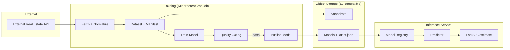

# Norway Real Estate Price Estimator

**Production-grade AI / MLOps project** for estimating **current market prices** of residential real estate in Norway based on historical transaction data.

The project demonstrates a **full end-to-end AI system**:

> data ingestion → feature engineering → model training → quality gating → model registry → inference API → Kubernetes → CI/CD

This repository is intentionally built as a **realistic production-like system**, not a toy ML notebook.

---

## 🚀 What this project does

- Fetches real real-estate transactions from an external API
- Builds validated, reproducible training datasets
- Trains regression models for price estimation
- Computes rich quality metrics (absolute & relative)
- Applies **quality gating** before publishing models
- Stores immutable artifacts in object storage (S3 compatible)
- Serves predictions via FastAPI
- Retrains models automatically on a schedule (Kubernetes CronJob)
- Deploys to Kubernetes via Helm (kind / GKE)
- Supports full CI/CD via GitHub Actions

---

## 🧱 High-level architecture


## 📦 Core components

### 1️⃣ Training pipeline
Runs as a Kubernetes **CronJob** (and can be executed manually).

### Pipeline stages

- Fetch transactions for a given period
- Normalize and validate rows
- Build a reproducible training dataset
- Train a regression model
- Evaluate metrics
- Apply quality gating
- Publish artifacts if gating passes

### Artifacts stored per training run

- `rows_raw.jsonl` — raw normalized rows
- `dataset.parquet` — trainable dataset
- `manifest.json` — dataset statistics & dropped rows
- `model.pkl` — trained model
- `metrics.json` — evaluation metrics
- `feature_schema.json` — schema used for inference
- `latest.json` — pointer to the active model

---

### 2️⃣ Model Registry

- Implemented on top of object storage
- Each model version is immutable
- `latest.json` points to the active production model
- API refuses to serve predictions until a valid model exists
- Registry is cached in-memory with TTL for performance

---

### 3️⃣ Inference API (FastAPI)

### Endpoints

- `GET /health` — liveness probe
- `GET /ready` — readiness probe (model loaded)
- `POST /estimate` — batch price estimation
- `GET /metrics` — raw model metrics
- `GET /metrics/summary` — human-friendly quality report

### Design principles

- Batch-first API (property_id → features)
- Strict validation (“better no estimate than a wrong one”)
- Predictor logic isolated from HTTP layer
- Explicit readiness based on model availability

---

### 4️⃣ Storage

* **Local / kind:** MinIO
* **GKE:** Google Cloud Storage via S3 interoperability
* Same code works in both environments

> ⚠️ **Note:** boto3 uploads require `ContentLength` to avoid aws-chunked uploads when using GCS S3 compatibility.
---

## 🧠 Machine Learning

### Current approach

- Tabular regression (scikit-learn)
- Model: `HistGradientBoostingRegressor`
- Target: `log1p(price)` with inverse transform on inference
- Sliding window: currently full dataset (rolling window planned)

### Feature groups

- Property size (`total_area`, `usable_area`)
- Location (`lat`, `lon`, `municipality`)
- Building metadata (year built, floor, rooms, bedrooms)
- Real estate type
- Derived ratios (e.g. area ratios)

---


## 📊 Model Quality & Metrics

### Raw metrics endpoint

**GET `/metrics`**

Returns the exact contents of `metrics.json` stored in the registry.

---

## 🧪 Model Quality Report

**GET `/metrics/summary`**

A human-friendly report designed for quick evaluation by engineers and stakeholders.

### Includes

- Overall metrics (MAE, RMSE, MdAPE, WAPE, AE_p90)
- Metrics per `realestate_type`
- Best / worst performing segments
- Automatic risk flags
- Tail-risk detection
- Thresholds used for interpretation

### Example usage

```bash
curl -s http://localhost:8000/metrics/summary | jq
```
This endpoint intentionally reads like a model evaluation report, not a raw ML dump.

---

## 🚦 Quality Gating

A newly trained model is published **only if**:
- Minimum dataset size is met
- Overall quality does not degrade beyond configured thresholds
- Key segment (`enebolig`) does not regress excessively
- Optional relative error metrics (MdAPE / WAPE) stay within bounds

If gating fails → **previous model remains active**.

This prevents silent production regressions.

---

## ☸️ Kubernetes & Deployment

- Helm chart located in `deploy/helm`
- Environments
    - `kind` — local development
    - `GKE` — production-like cluster
- Explicit CPU / memory requests & limits
- Training runs as a `CronJob`
- API runs as a `Deployment` with readiness probes

---

## 🔄 CI/CD

**Release flow:**

1. Push git tag `vX.Y.Z`
2. GitHub Actions:
   * build Docker image
   * push to GHCR
   * deploy to GKE via Helm
   * update Kubernetes secrets
3. Rolling update with readiness checks

## 🧪 Local development

### Prerequisites

- Docker
- Python 3.11+
- `uv`
- `kind`
- `kubectl`
- `helm`
- RabbitMQ
- MinIO (optional)

### Run locally
```bash
cp .env.example .env
uv lock
make compose-up
honcho start
```
## Open:
- [Swagger](http://localhost:8080/docs)
- [ReDoc](http://localhost:8080/redoc)
- [Health](http://localhost:8080/health)


---

## 🚢 Deploy to kind
```bash
kind create cluster --name ree
kubectl cluster-info --context kind-ree

TAG=dev-$(git rev-parse --short HEAD)
docker build -t ree:$TAG -f deploy/Dockerfile .
kind load docker-image ree:$TAG --name ree

kubectl create namespace ree 2>/dev/null || true
kubectl -n ree delete secret ree-secrets --ignore-not-found
kubectl -n ree create secret generic ree-secrets --from-env-file=.env.kind

helm upgrade --install ree deploy/helm -n ree -f deploy/helm/values_kind.yaml

kubectl -n ree port-forward svc/ree-api 8000:80
kubectl -n ree port-forward svc/ree-minio 9001:9001
```

### Run initial training manually:
```bash
kubectl -n ree create job --from=cronjob/ree-training ree-training-manual
```
### Note:
- Use you k8s config, example: `KUBECONFIG=~/.kube/kind-config kubectl`

---

## 🛣️ Roadmap (next steps)

- Rolling 12-month training window
- Incremental dataset updates
- Model v3 (feature interactions / geo features)
- Drift detection
- Prometheus metrics & dashboards
- Extended architecture narrative

---

# 📊 Model Evaluation Report

## 🧠 Model Overview

- **Model type:** `HistGradientBoostingRegressor` (sklearn)
- **Model family:** Gradient Boosting (histogram-based)
- **Version:** `20260125-1612-7e1894a`

### Target transformation
- **Target:** `log1p`
- **Prediction inverse transform:** `expm1`

---

## 📦 Dataset

| Split | Records |
|------|---------|
| Train | 19,157 |
| Test  | 4,790  |

---

## 📈 Overall Performance (Test Set)

| Metric | Value |
|------|------|
| **MdAPE** | **12.62 %** |
| **WAPE** | **18.72 %** |
| **MAE** | 880,501 NOK |
| **RMSE** | 1,524,772 NOK |
| **AE P90** | 1,980,151 NOK |

---

## 🏘️ Performance by Real Estate Type

| Segment | Status | MdAPE (%) | WAPE (%) | AE P90 (NOK) |
|-------|--------|-----------|----------|--------------|
| **Leilighet** | ✅ Good | **9.80** | 15.36 | 1,678,491 |
| **Rekkehus** | ✅ Good | 11.42 | 15.39 | 1,563,192 |
| **Tomannsbolig** | ⚠️ OK | 14.16 | 19.45 | 2,201,099 |
| **Enebolig** | 🚨 Risk | 20.12 | 25.01 | 2,678,550 |
| **Hytte** | 🚨 Risk | **27.39** | 31.67 | 2,053,856 |

---

## 🥇 Best & Worst Segments

- **Best segment:** `leilighet` — MdAPE **9.8%**
- **Worst segment:** `hytte` — MdAPE **27.39%**

---

## 🎯 Quality Thresholds

| Threshold | Value |
|---------|-------|
| **MdAPE (Good)** | ≤ 12% |
| **MdAPE (OK)** | ≤ 18% |
| **AE P90 Tail Risk** | ≥ 2,000,000 NOK |

---

## 📝 Notes

- Worst segment is **`hytte`** (MdAPE 27.39%)
- Likely causes:
  - High price heterogeneity
  - Sparse or noisy data

---

## ⏱️ Metadata

- **Generated at:** `2026-01-25T17:47:06Z`
